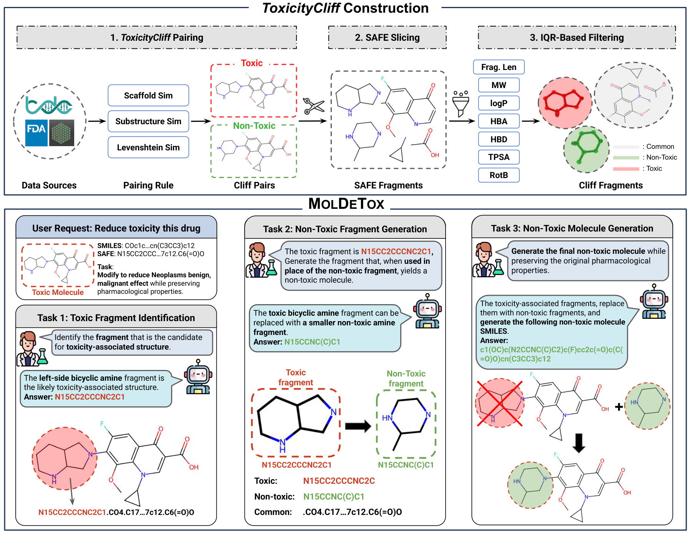

# MolDeTox

Code for building the MolDeTox benchmark and for running and scoring models on it.

MolDeTox is built from **toxicity cliffs**: pairs of molecules that are structurally almost identical but carry opposite toxicity labels. The difference between the two molecules is a small set of fragments, which gives a well-defined detoxification target and three tasks of increasing difficulty:

| Task | Input | Answer |
| --- | --- | --- |
| Task 1 | the toxic molecule | the fragment(s) responsible for its toxicity |
| Task 2 | the toxic molecule and its toxic fragment(s) | the non-toxic replacement fragment(s) |
| Task 3 | the toxic molecule | the whole non-toxic molecule |

Molecules are represented in [SAFE](https://github.com/datamol-io/safe), a SMILES-compatible
format that writes a molecule as dot-separated fragments, so that a fragment-level answer is a
substring of the molecule-level one. Every task comes in a **single-fragment** and a
**multi-fragment** setting, depending on how many fragments separate the pair.



The top row is how the pairs are built: candidates are drawn from the data sources, paired by
the three similarity rules, sliced into SAFE fragments, and filtered on fragment length and
property deltas. What survives is a pair that differs in a few fragments, coloured here as
toxic, non-toxic and common. The bottom row is one such pair walked through the three tasks.

## Install

```bash
pip install -r requirements.txt
```

SAFE strings are decoded with [safe-mol](https://github.com/datamol-io/safe), which the
requirements pull in. The optional entries at the bottom are only needed for local model
inference and for faster pair screening.

## Running a model

The QA files are all you need; they sit next to this directory in `MolDeTox_QA/`. Point `--qa`
at one file or at a directory, and `--model` at either an OpenAI model name or a local
checkpoint:

```bash
export OPENAI_API_KEY=...
python inference.py --qa ../MolDeTox_QA/test --model gpt-5.2

python inference.py --qa ../MolDeTox_QA/test --model /path/to/Qwen3-4B-Instruct
```

A directory is walked and every QA file below it is run. The task and the fragment setting are
read off the filename, so nothing else has to be specified. Predictions and a summary are
written under `--out` (default `outputs/`), and questions that already have an answer are
skipped, so an interrupted run can be restarted with the same command.

Use `--limit 20` for a quick check before launching a full run.

## Metrics

`evaluation.py` scores each answer as it is written. `metric_keys_for(task, step)` returns the
metrics reported for a task:

- **Task 1** — exact match over the fragment set, plus F1 in the multi-fragment setting.
- **Task 2** — exact match and Levenshtein distance, plus F1 in the multi-fragment setting.
- **Task 3** — exact match of the canonical SMILES, BLEU1, Morgan fingerprint Tanimoto,
  validity, and PRS.

**PRS** (property retention score) is `exp(-|QED6(toxic) - QED6(predicted)|)` over six QED
descriptors (MW, ALOGP, HBA, HBD, PSA, ROTB). It asks whether the model removed the toxic part
without otherwise redesigning the molecule, so it needs the toxic input molecule; that is read
from the QA row, which `inference.py` passes along.

Levenshtein distance, MACCS and RDKit similarity are still written per prediction but are left
out of the reported means. On activity-cliff pairs they are not interpretable on their own — a
prediction that simply copies the toxic input scores about 0.89 MACCS similarity while being
exactly wrong.

## Rebuilding the benchmark

Only needed if you want to change the data; the QA files are enough to reproduce the numbers.
The toxicity cliffs themselves are in `../toxicitycliff/`, so steps 1 and 2 can be skipped if
you only want to regenerate the questions.

```bash
# 1. find toxicity cliffs  ->  toxicitycliff.csv
#    input: one row per molecule, columns dataset_name, endpoint, smiles, label (1 = toxic)
python ToxicityCliff_pairing.py --input molecules.csv --out toxicitycliff.csv

# 2. scaffold split, 9:1   ->  splits/default/{train,test}.csv
python spliter.py --input toxicitycliff.csv --out-dir splits/default

# 3. build the QA files    ->  QA/MolDeTox_QA/<split>/<split>_<task>_<single|multi>.jsonl
python Build_MolDeTox_QA.py --split all --task all \
    --train_csv splits/default/train.csv --test_csv splits/default/test.csv
```

The split is by Bemis-Murcko scaffold, so a scaffold in the training set does not reappear in
the test set.

Step 3 also writes `task3_cot_safe_gen`, the stepwise chain-of-thought variant of Task 3, which
asks for the toxic and the replacement fragments before the final molecule.

## Files

| File | |
| --- | --- |
| `ToxicityCliff_pairing.py` | finds toxicity-cliff pairs and filters them down |
| `spliter.py` | scaffold split into train and test |
| `Build_MolDeTox_QA.py` | writes the QA jsonl files |
| `MolDetox_QA_template.py` | the question text for each task |
| `inference.py` | runs a model over QA files and scores the answers |
| `evaluation.py` | the metrics |
| `safe_functions.py` | SMILES to SAFE conversion and fragment handling |
